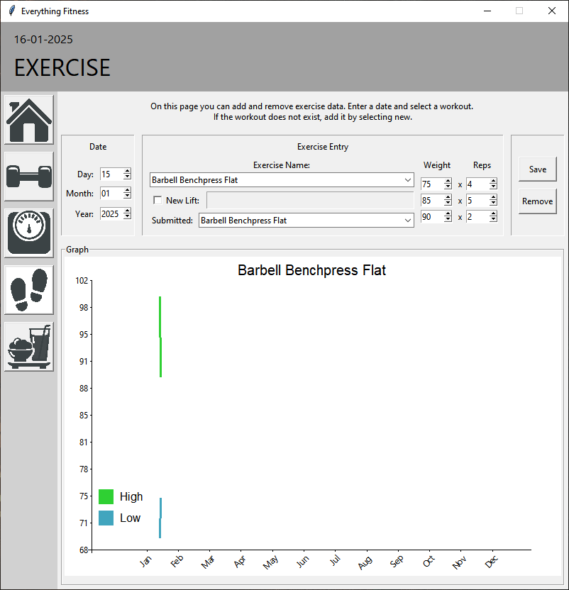
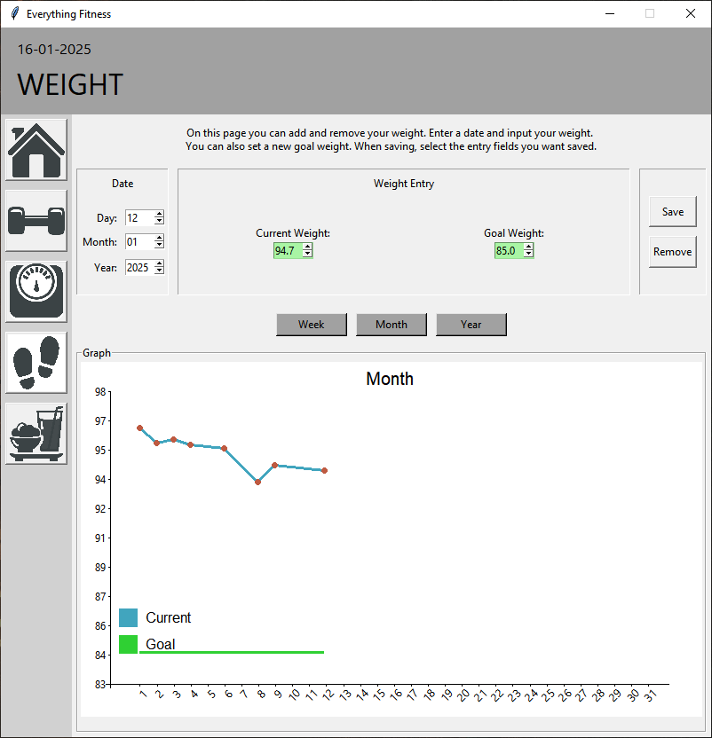
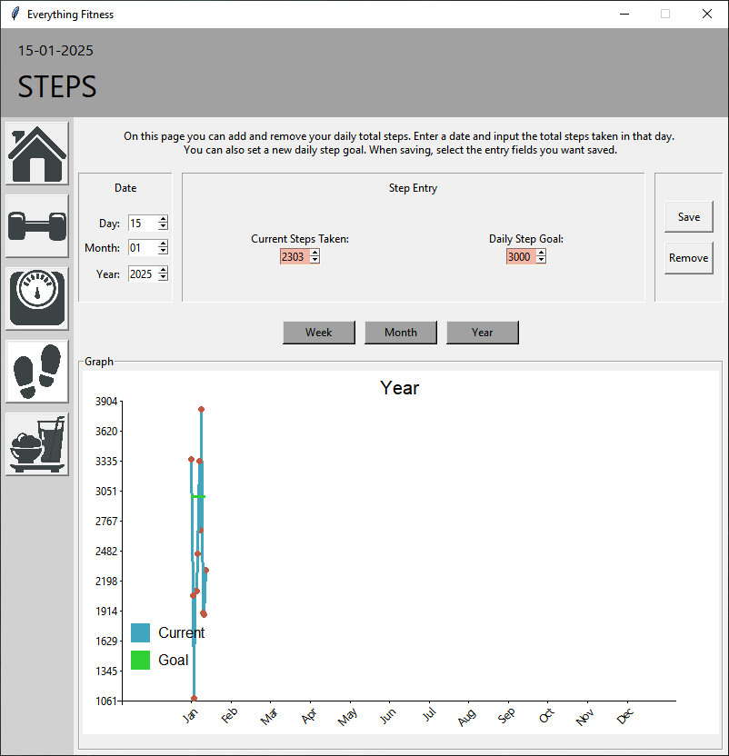
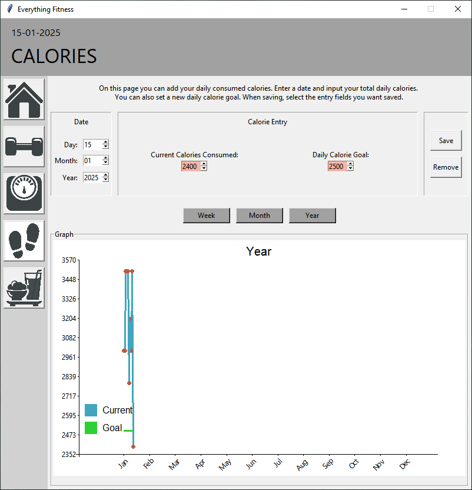

# Everything Fitness
Everything Fitness is a desktop application built in Python using tkinter and SQLite to record and track many fitness related metrics:
- Exercise lifts - exercise name, weight, and reps performed,
- Weight - once per day weight recording,
- Steps - total steps performed in a day,
- Calories - total calories consummed in a day.

There are many fitness apps, but few allowing the tracking of all these metrics at once. I wanted an app that I could use personally that had exactly what I wanted and displayed my stats all at once with useful calculations, such as my current trends (e.g., losing/gaining weight, performing more steps, etc). 

### Future considerations:
- Created some test files which use Pytest - far from all encompassing.
- Creating this in Python using tkinter has left a lot to be desired in the way of styling - personalisation/UIX needs some consideration.
- A desktop application is not the right choice for this type of app - a mobile app makes more sense since you can track as you go, rather than only once you get on your PC.
- Mobile app could interface with other applications so the user need not manually input data (e.g., steps from Samsungs Health app).

## Dashboard
An overview of the users stats is displayed for each metric in a widget on their dashboard. These provide quick information on the users recent to long term fitness progress. This information includes:
- daily, weekly, monthly, and yearly changes and totals,
- trends which display the direction data is heading - colour coded (red, green, blue) depending on the users goals,
- line and bar charts displaying most recently including data (created with tkinter canvas widget)

## Tracking Pages
Each tracking page allows the user to record data for any selected date. Weight, steps, and calorie tracking allows only a single entry per day, with a tracked day being indicated by green spinboxes. Each page includes week, month, and year graphs which display all recorded data in those periods (created with tkinter canvas widget).

